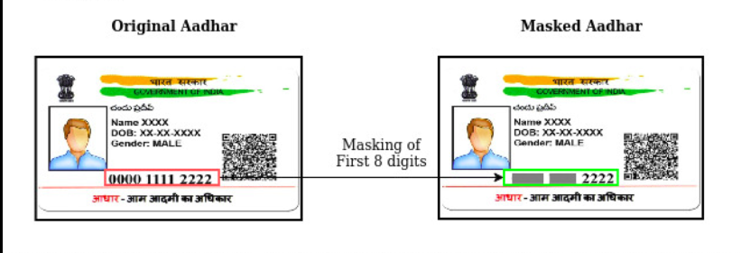
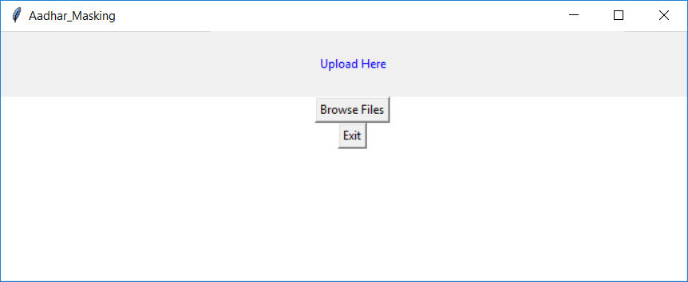
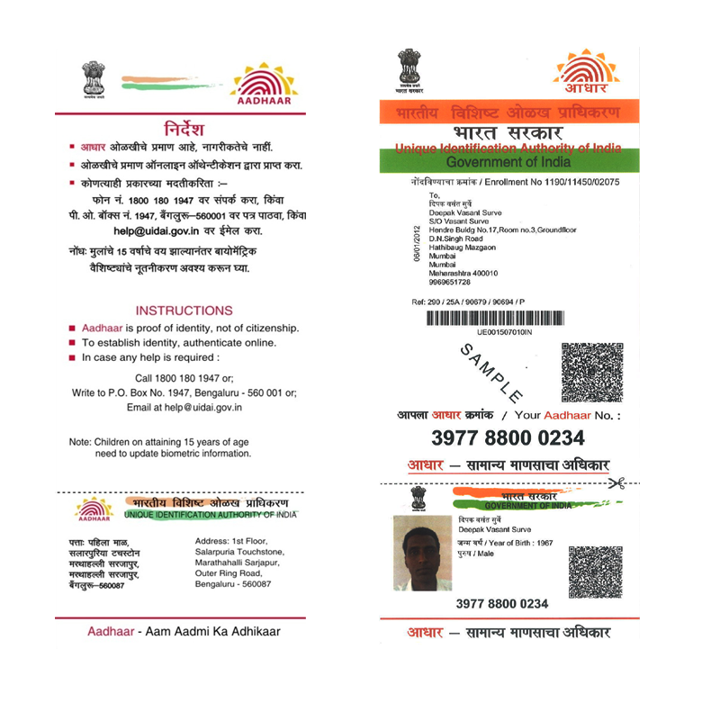
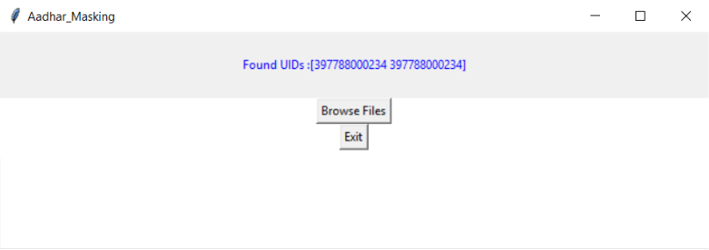
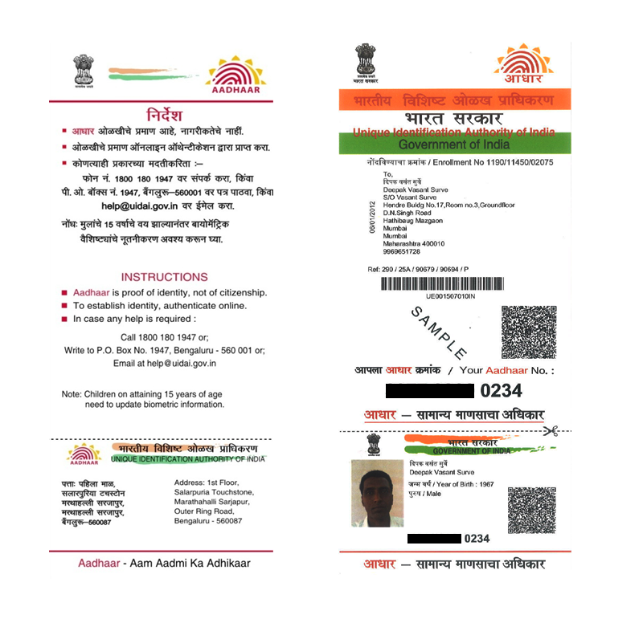

# Aadhaar-UID-Masking-Tool
 

This project provides, Support of Extraction, Verification and Masking of Aadhaar UIDs from photos and scanned documents. The solution to the problem involves use of PyTesseract Optical Character Recognition engine and OpenCV for image processing. 

# Abstract
In today's world scams are being done by taking personal information. Aadhaar card is one of the
document which can be used to get information of a person because it has its address, mobile
number, personal information and also bank accounts attached to it so to prevent that information
aadhaar card number has to be hidden not completely but partially like account number so that
personal and financial information can be preserved so that frauds can be reduced to a certain extent.
So we aimed to build a **CNN** model to mask the partial **UID (Unique Identification)** of the aadhaar irrespective of the format and orientation of aadhaar provided. This model achieved an accuracy of 94.6 % for both training as well as validation.

## Example

# Snapshots
**Note:** For testing purposes we have used a publically available Aadhaar Sample. Which is available on (uidai.gov.in), We have not harmed anyone's privacy.

- Taken this sample aadhar for the testing.

App window will show the all available UID in the Aadhar

In the last step it will save the Masked Copy in the project folder itself.

# Main Features

 - It can do batch operations and save the final output in **.tiff** file
   formate. 
  - Provide excellent PDF merging support.
  - Able to recognize UID from any type of file format such as
   jpeg, png, pdf etc. 
   - The language is different in Aadhaar in different
   regions and this is a very critical problem, but our model can also
   recognize different languages easily.
   
# Algorithms Used
In our solution pipeline we use some algorithms such as:

**1.Verhoeff Algorithm:** Aadhaar UID is a 12-digit number in which the last digit is a checksum digit
calculated using this algorithm. It utilizes some tables (multiplication, inverse and permutation) for
calculating the checksum bit. For validating, the same tables are used.

**2.ESRGANs:** Enhanced Super-Resolution Generative Adversarial Networks are capable of
generating realistic textures during single image super-resolution. It achieves better visual quality
with more realistic and natural textures than the original picture.

# Installation
**Note:** Because of some dependencies issues with Tensorflow 2.0, We have used Python 3.7.9, This project is perfectly working on Windows machines but causing some issues with Linux based systems.

**Step-1:** Clone this repo and Install Python 3.7.9 in your machine.

**Step-2:** Install **requirements.txt** by entering below command in Windows Command Prompt

    pip install -r requirements.txt

**Step-3:** Extract **poppler-0.68.0_x86** in **C:\Program Files** and provide the path of bin that is **C:\Program Files\poppler-0.68.0\bin** in the main code.

**Step-4:** Install **tesseract-ocr-w64-setup-v5.0.0-alpha.20201127** and provide its path as *pytesseract.pytesseract.tesseract_cmd =r'C:\Program Files\Tesseract-OCR\tesseract*' in code snippet.

**Step-5:** Run the code Masking.py

All Done!

